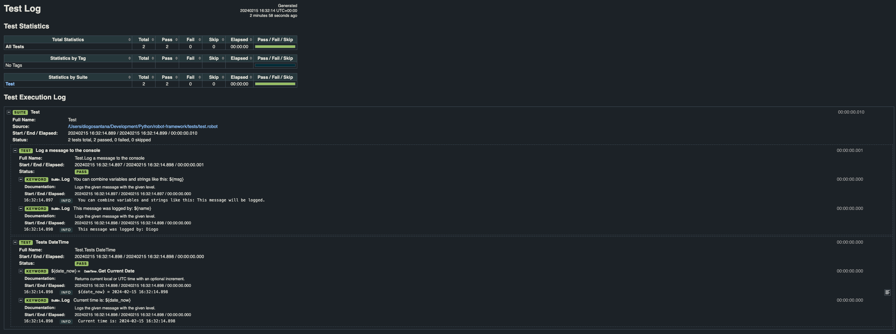

# Robot

Playground setup for Robot Framework playaround.

## Install

Via pip, install:

``pip install robotframework``

## Commands

To run all tests within /tests/ folder, please run:

``python3 -m robot tests/**`` OR ``robot tests/**``

<b>NOTE:</b>

Above commands will cause result output to be scattered within the root folder of project.

For specified directory for results you would need to run command:

``robot -d results -m tests/**``

First specifying the folder of output, and then tests to run.

## Env variables

Refer to variables docs on [Robot - Variables:](https://robotframework.org/robotframework/latest/RobotFrameworkUserGuide.html#using-variables)

## Requirements

For pip 'Requirements' install, please refer to [Pip - Requirements](https://pip.pypa.io/en/stable/user_guide/#id1)

## Reports

Please see below example of a generated report.

